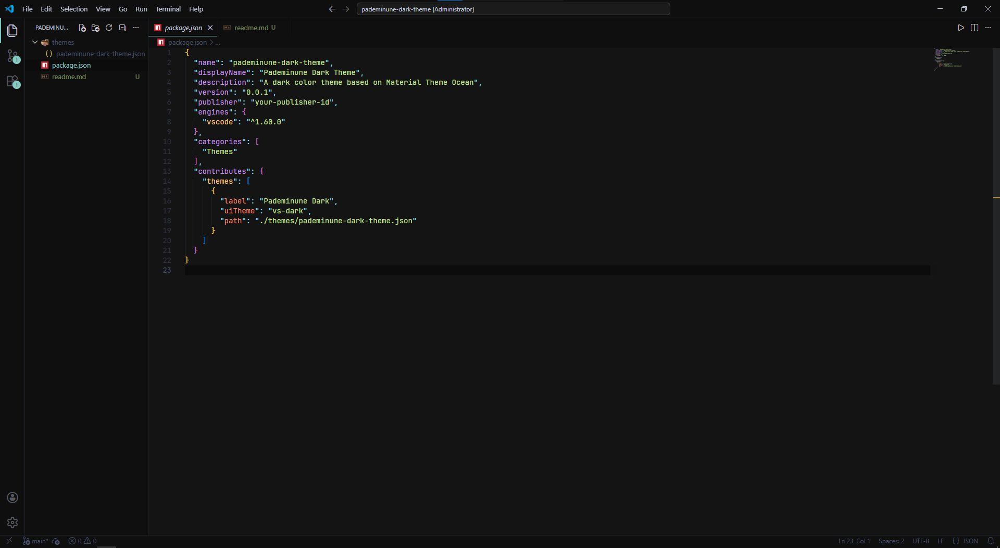

# Pademinune Dark Theme

A dark color theme for Visual Studio Code based on Material Theme Ocean, with a near-black background (`#141414`) and a carefully tuned color palette for comfortable long-session coding.

## Features

- Deep dark background (`#141414`) with a slightly darker sidebar/panels (`#0F0F0F`)
- Semantic highlighting enabled
- Distinct colors for keywords, strings, types, functions, and comments across many languages
- Language-specific tuning for JavaScript/TypeScript/JSX, Python, C#, CSS, HTML, JSON, YAML, Markdown, and more
- Yellow cursor (`#FFCC00`) for high visibility

## Installation

1. Clone or download this repo into your VS Code extensions folder:
   - Windows: `%USERPROFILE%\.vscode\extensions\`
   - macOS/Linux: `~/.vscode/extensions/`
2. Reload VS Code.
3. Open the Command Palette (`Ctrl+Shift+P` / `Cmd+Shift+P`), run **Preferences: Color Theme**, and select **Pademinune Dark**.

## Color Highlights

| Element | Color |
|---|---|
| Background | `#141414` |
| Foreground | `#C8CDE0` |
| Keywords | `#89DDFF` |
| Strings | `#C3E88D` |
| Functions | `#82AAFF` |
| Types / Classes | `#FFCB6B` |
| Numbers | `#F78C6C` |
| Comments | `#464B5D` (italic) |
| Storage modifiers | `#C792EA` |
